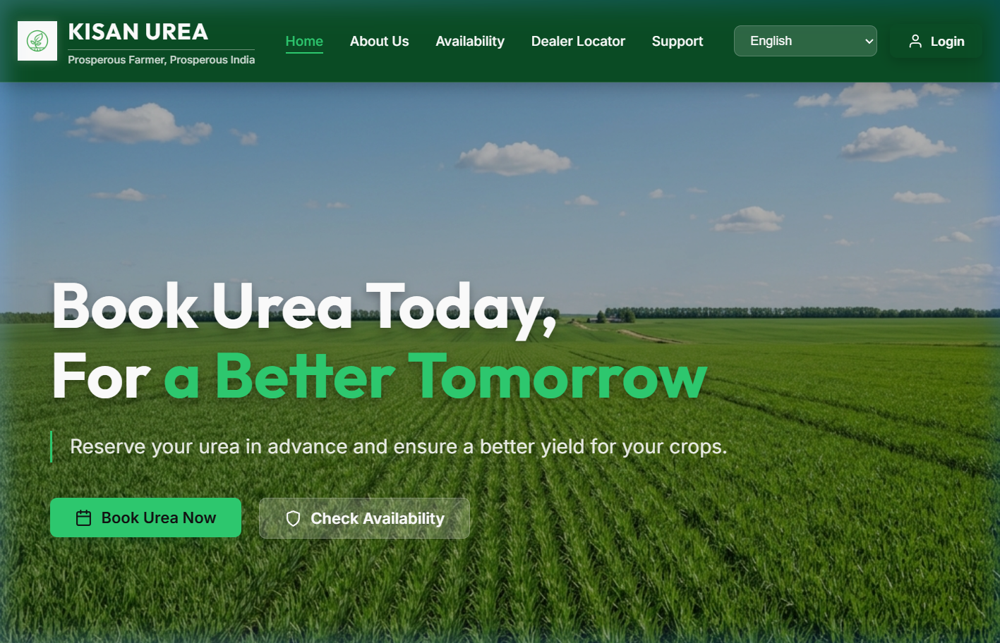
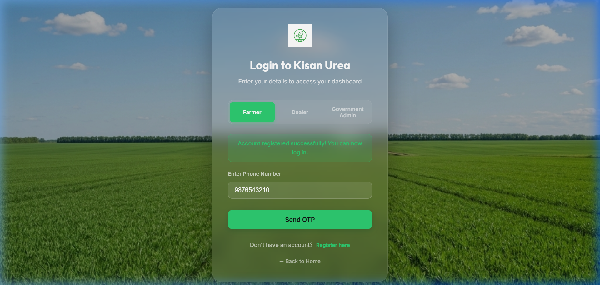
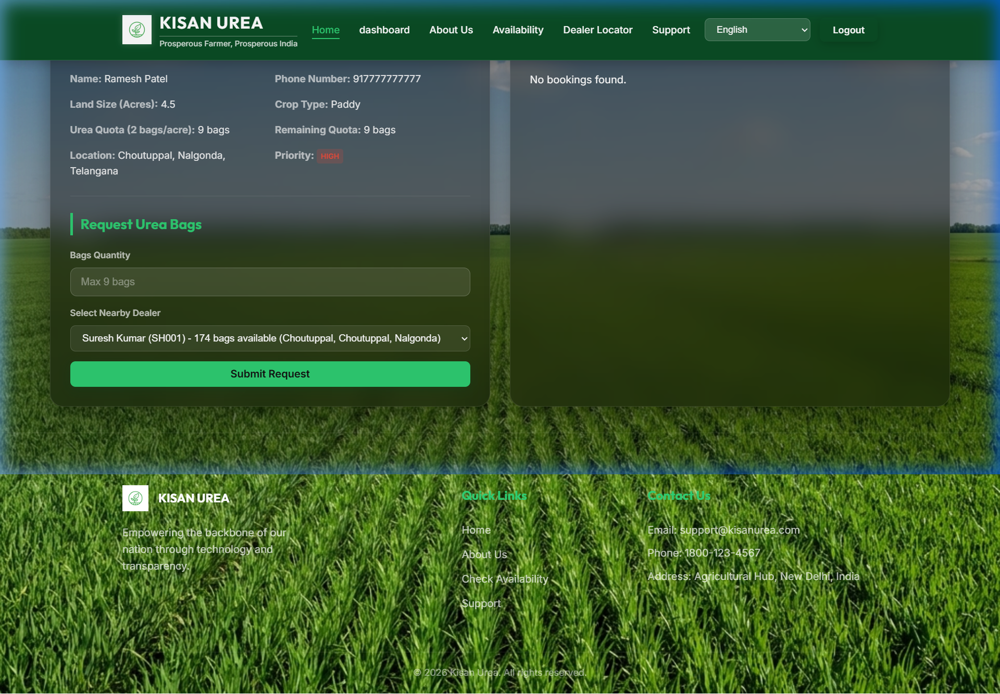
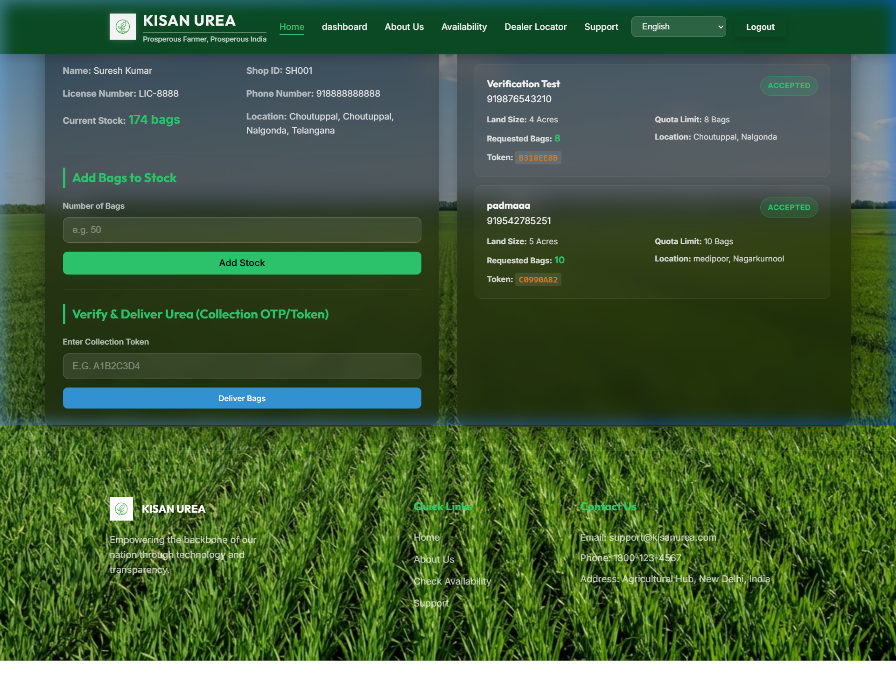
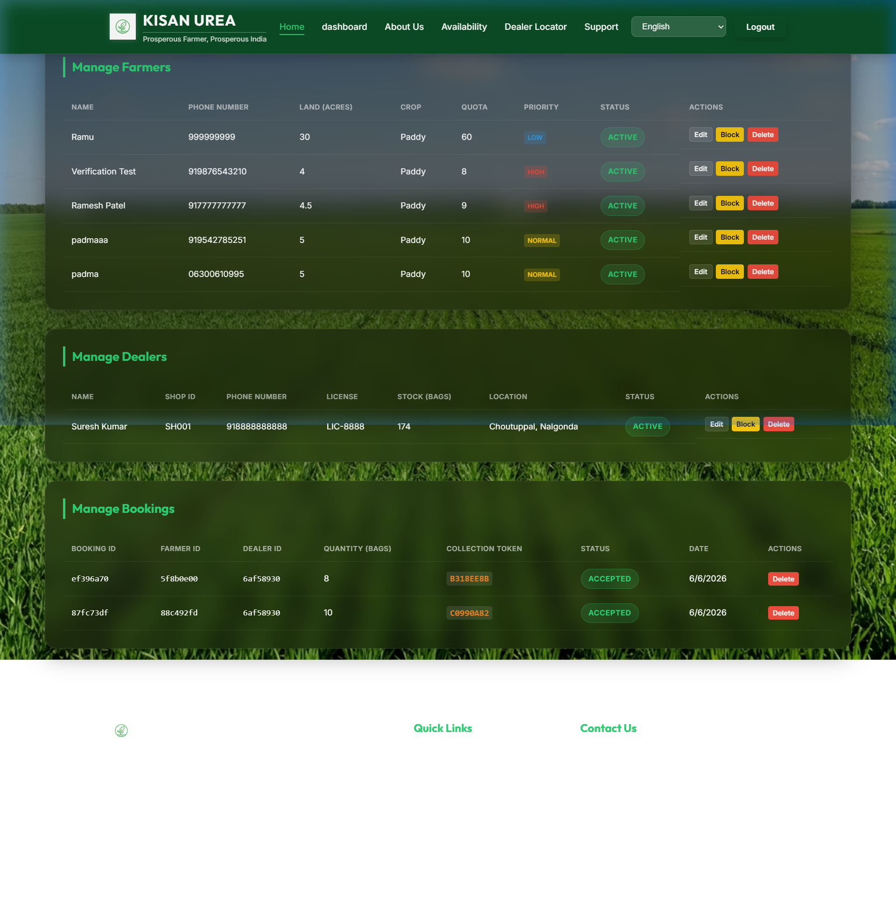

# Kisan Urea - Empowering Farmers | Book Urea Online

Kisan Urea is India's leading digital platform for streamlining fertilizer booking, stock tracking, and dealer operations. The project consists of a Spring Boot JPA backend connected to a MySQL database and a React/Vite frontend.

---

## 🚀 Live Deployments

- **Frontend (Vercel)**: [https://frontend-aja-y.vercel.app](https://frontend-aja-y.vercel.app)
- **Backend API (Render)**: [https://urea-booking-system.onrender.com](https://urea-booking-system.onrender.com)

---

## 🛠️ Technology Stack

### Backend
- **Core Framework**: Spring Boot 3.2.5
- **Database Access**: Spring Data JPA & Hibernate
- **Database**: MySQL 8.0
- **Build Tool**: Apache Maven 3.9
- **Java Version**: JDK 17

### Frontend
- **Framework**: React 19 (JavaScript)
- **Tooling/Bundler**: Vite 8
- **Routing**: React Router 7
- **Styling**: Vanilla CSS

---

## 🔑 Seeded Test Credentials

For development and demonstration purposes, the database is auto-seeded with test accounts for each of the system roles. 

You can use the **OTP (`XXXX`)** to log in directly to any of the accounts listed below:

| Role | Phone Number | Default Name | Quota / Shop ID |
| :--- | :--- | :--- | :--- |
| **Farmer** | `91XXXXXXXXXX` | Ramesh Patel | 9.0 quota |
| **Dealer** | `91XXXXXXXXXX` | Suresh Kumar | SH001 |
| **Admin** | `91XXXXXXXXXX` | System Admin | - |

---

## ⚙️ Local Setup Instructions

### Prerequisites
- Java JDK 17
- Node.js (v18+)
- MySQL Server 8.0 

### 1. Database Setup
Ensure you have a local MySQL instance running. The application is configured to automatically create the `kisanurea` schema on startup. 

Update database credentials in [backend/src/main/resources/application.properties](file:///d:/p1/backend/src/main/resources/application.properties):
```properties
spring.datasource.url=jdbc:mysql://localhost:3306/kisanurea?createDatabaseIfNotExist=true&useSSL=false&allowPublicKeyRetrieval=true&serverTimezone=UTC
spring.datasource.username=root
spring.datasource.password=XXXXX
```

### 2. Run Backend
Go to the backend directory and run:
```bash
cd backend
mvn spring-boot:run
```
The server will start on [http://localhost:8080](http://localhost:8080).

### 3. Run Frontend
Go to the frontend directory, install dependencies, and run:
```bash
cd frontend
npm install
npm run dev
```
The client app will start on [http://localhost:5173](http://localhost:5173). 

Ensure your [frontend/.env.local](file:///d:/p1/frontend/.env.local) points `VITE_API_BASE_URL` to the local backend:
```env
VITE_API_BASE_URL="http://localhost:8080"
```

---

## 🌐 Production Deployment Configuration

The codebase is configured for automated cloud deployment via a monorepo setup:

- **Vercel (Frontend)**: Utilizes the root [package.json](file:///d:/p1/package.json) and [vercel.json](file:///d:/p1/vercel.json) to trigger builds from the root and copy compiled Vite assets directly from `/frontend/dist` to `/dist` at the repository root.
- **Render (Backend)**: Automatically pulls the repository, builds the Spring Boot package using Maven inside the root [Dockerfile](file:///d:/p1/Dockerfile), and spins up the Docker JRE container mapping it to the configuration parameters declared in [render.yaml](file:///d:/p1/render.yaml).

---

## 📸 Screenshots & Output

### 1. Live Production Landing Page


### 2. Registration Redirect & Phone Pre-fill


### 3. Farmer Dashboard (`917777777777` / OTP `123456`)


### 4. Dealer Dashboard (`918888888888` / OTP `123456`)


### 5. Admin Dashboard (`918187872374` / OTP `123456`)

